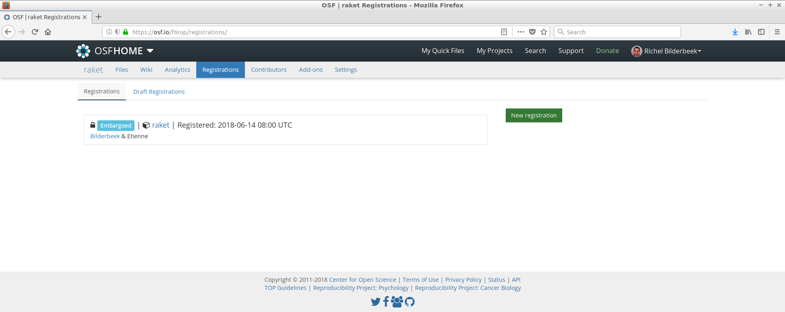

# raket_article

Article for [raket](https://github.com/richelbilderbeek/raket).

## Which file contains the article?

[article.tex](article.tex) contains the article. All other files are generated from it.

## References

 * [1] Bilderbeek, Richel JC, and Rampal S. Etienne. "The error when inferring phylogenies with incipient species by a birth-death model.". First registration at the [Open Source Framework](https://osf.io/) on 2018-06-14. Second registration at the [Open Source Framework](https://osf.io/) on 2018-09-03.

